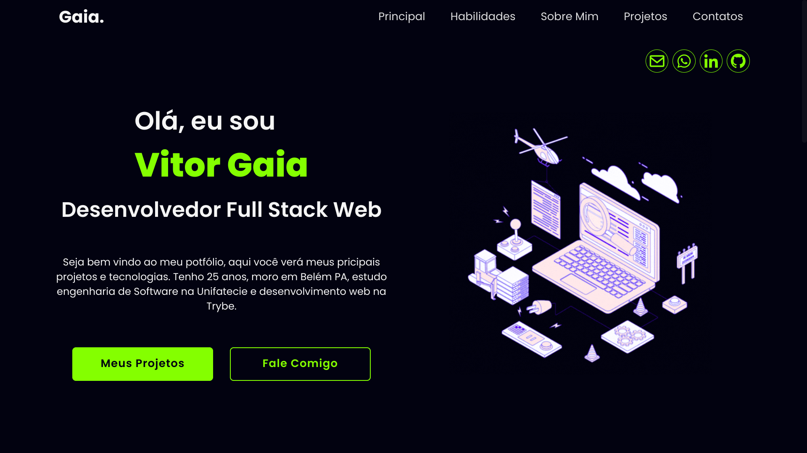

# Seja bem-vindo ao meu portfólio!

## 📘 Sobre
Neste hub você encontrará meus principais projetos publicados e repositórios. Se for do seu interesse fique de olho aqui pois sempre estou adicionando novos projetos.

## 🛠️ Ferramentas
- React.js
  - Hooks e Context API
- Node.js
- Vite
- CSS3

## ▶️ [Deploy da Aplicação](https://code.visualstudio.com/)
<div align="center">
  
</div>

## 📝 Pré Requisitos
Antes de começar, você vai precisar ter instalado em sua máquina as seguintes ferramentas:
[Git](https://git-scm.com), [Node.js](https://nodejs.org/en/).  
Além disto é bom ter um editor para trabalhar com o código como [VSCode](https://code.visualstudio.com/);

## 🎮 Como executar localmente
```bash
# Clone este repositório
$ git clone git@github.com:vitorGaia/trybe-futebol-clube.git

# Instale as dependências
$ npm install

# Inicie em modo desenvolvimento
$ npm run dev

# Acesse o frontend da aplicação
$ http://localhost:5173/